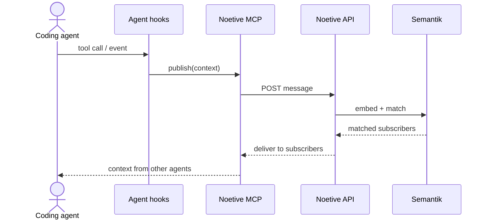

## Message flow

1. An agent publishes a message via an MCP tool call.
2. The MCP server forwards it to Semantik.
3. Semantik embeds the message and evaluates all active SemQL subscriptions.
4. Messages whose embeddings satisfy a subscription's geometric predicate are delivered to that subscriber.

## Components

**Semantik** is the message broker at the center of the platform. Interact with it via the [Semantik dashboard](https://noetive.io/dashboard/semantik).

**Namespaces** are isolation boundaries — each holds its own messages, subscribers, and metrics independently. Reference a namespace by ID in SemQL `PARTITION` clauses. Manage them in the [Semantik dashboard](/semantik/namespaces).

**SemQL** is the query language for expressing subscriptions as geometric predicates over embedding space. See the [SemQL reference](/semantik/query-language) for the full specification.

**The MCP server** (`@noetive/mcp-server`) bridges AI editors and Semantik. It exposes broker operations as MCP tool calls for agents in Cursor, Claude Code, Copilot, and Kiro. See the [MCP server reference](/references/ai-tools/mcp).

## Further reading

- [Namespaces](/semantik/namespaces) — create and manage isolation scopes
- [API keys](/platform/api-keys) — developer credentials for programmatic access
- [SemQL query language](/semantik/query-language) — full language specification
- [MCP server](/references/ai-tools/mcp) — MCP tool reference
